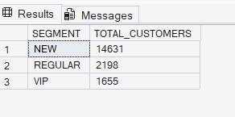
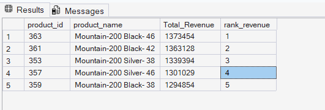
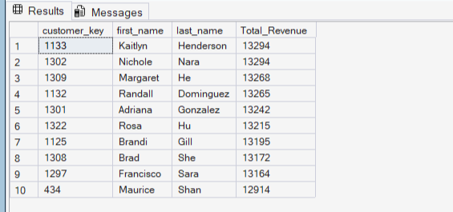
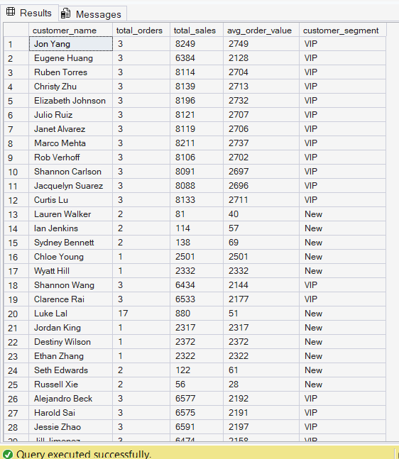

# Sales & Customer Analytics Using SQL

## Project Overview
This project demonstrates how SQL can be used to transform raw transactional data into meaningful business insights. Using a retail sales database containing customer, product, and sales information, I performed a comprehensive exploratory data analysis (EDA) and built analytical reports to evaluate business performance, customer behavior, and product performance.

## Business Objectives
- Understand the structure and quality of the database.
- Analyze sales performance across products, customers, and time periods.
- Identify high-value customers and top-performing products.
- Segment customers based on purchasing behavior.
- Build customer and product reports to support business decision-making.

## Dataset Description
The database consists of transactional sales data and supporting dimension tables.

Tables Used
| Table | Description |
|-------|-------------|
| fact_sales | Sales transaction records |
| dim_customers | Customer information |
| dim_products | Product information |

## Project Workflow
1. Database Exploration
- Explored database structure and schema.
- Examined tables, columns, and relationships.
- Identified primary and foreign key relationships.

2. Dimension Exploration
Analyzed business dimensions including:

- Customers
- Products
- Categories
- Subcategories

3. Date Exploration
Performed time-based analysis by:
- Identifying first and last transaction dates.
- Measuring business activity duration.

4. Measures Exploration
Calculated key business metrics:

- Total Sales
- Total Orders
- Total Quantity Sold
- Average Sales Value
- Customer Count

5. Magnitude Analysis
Performed magnitude analysis to understand the scale and contribution of different business entities.

Key analyses included:

- Total customers by country.
- Customer distribution by gender.
- Total products available in each category.
- Average product cost by category.
- Revenue contribution by product category.
- Revenue generated by individual customers.
- Distribution of sold quantities across countries.

6. Ranking Analysis
Applied ranking techniques to identify top and bottom performers across products and customers.

Key analyses included:

- Top 5 products generating the highest revenue.
- Bottom 5 products with the lowest sales performance.
- Top 10 customers by total revenue generated.
- Customers with the fewest orders placed.
- Product ranking using window functions (RANK()).
- Customer ranking based on revenue contribution.

7. Change Over Time Analysis
Analyzed business performance trends over time to identify growth patterns, seasonality, and changes in key business metrics.

Key analyses included:

- Yearly sales performance analysis.
- Monthly sales trend analysis.

8. Data Segmentation
Applied segmentation techniques to group products and customers into meaningful business categories.

9. Customer Report
Built a customer-level analytical report containing:

- Customer Information
- Total Orders
- Total Sales
- Total Quantity Purchased
- Customer Segments
- Average Order Value

10. Product Report
Built a product-level analytical report containing:

- Product Performance Metrics
- Revenue Contribution
- Product Rankings
- Category Analysis
- Sales Volume Metrics

## SQL Concepts & Techniques Used
- SELECT Statements
- Filtering (WHERE)
- Aggregations (SUM, AVG, COUNT)
- GROUP BY
- ORDER BY
- CASE WHEN
- Joins
- Common Table Expressions (CTEs)
- Window Functions
- Ranking Functions
- Date Functions

## Key Insights
- The **Bikes category** was the highest revenue-generating category, dominating overall sales performance.
- The majority of customers were **New customers (14,631)**, indicating strong acquisition but relatively lower customer maturity.
-  Although **VIP customers were the smallest group (1,655)**, they contributed the highest value in terms of spending.
-  Sales were heavily concentrated in the **United States**, followed by Australia and Canada, showing strong geographic imbalance in demand.

## Project Highlights
###Customer Segmentation

### Top Products by Revenue

### Top Customers

### Customer Report

## Conclusion
This project demonstrates end-to-end SQL analytics capabilities, from exploratory analysis to business reporting. It showcases practical SQL skills used by data analysts to extract insights, evaluate business performance, and support data-driven decision-making.
